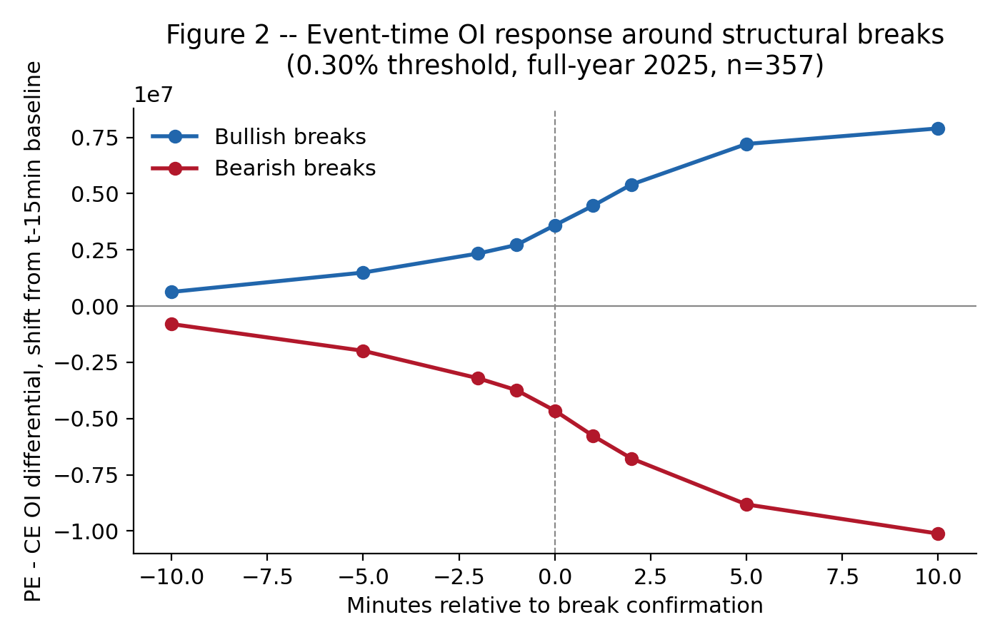
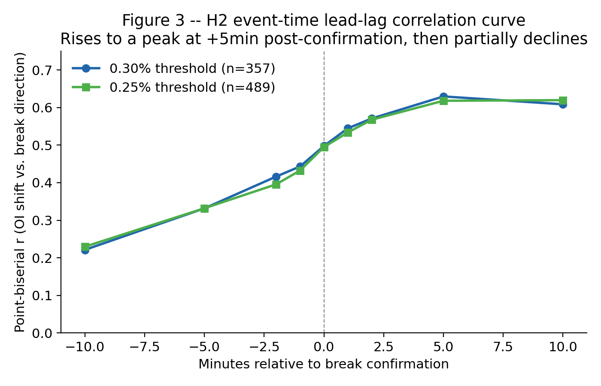
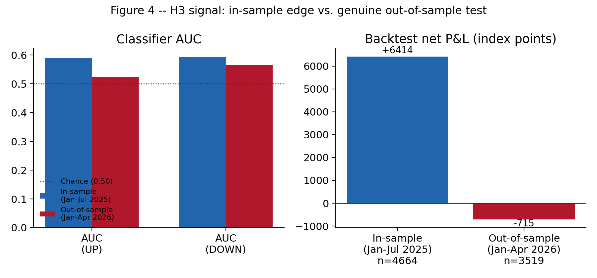

# OI Repositioning Around NIFTY Price-Structure Breaks — Reproduction Code

This repository is the full analysis pipeline behind *"Open Interest
Repositioning Around Intraday Price-Structure Breaks: Evidence from NIFTY 50
Index Options"* (NIFTY 50 index options, 2025 in-sample / 2026
out-of-sample), reproduced from raw data through to every number, table, and
figure in the paper.

This version splits the code into a small shared library (`lib/`) plus one
standalone script per paper section (`scripts/`), so each piece of the
analysis can be read, run, and checked on its own. No number, table, or
statistical result differs from the notebook version — this is a structural
reorganization only.

**Three nested hypotheses tested, in order:**

- **H1 (association):** OI shifts around a structural price break are
  statistically associated with the direction of that break.
- **H2 (event-time pattern):** that association's timing relative to break
  confirmation — a lead-lag characterization, not a causal test.
- **H3 (tradable edge):** a real-time signal built from the OI shift, tested
  under a genuine out-of-sample discipline (all parameters locked from
  Jan–Jul 2025 data, applied verbatim to a held-out Jan–Apr 2026 sample).

## Headline results

Generated by `scripts/13_figures.py` — see
[`results/README.md`](results/README.md) for what each one shows.

| Event-time OI response (H2) | Correlation curve (H2) |
|---|---|
|  |  |



The short version: OI repositioning is strongly and reactively associated
with structural-break direction (H1, H2), but a real-time signal built from
that association, locked on 2025 data, does not survive a genuine 2026
out-of-sample test (H3) — a positive research result about the limits of
the association, not a trading strategy.

## Headline numbers

| Result | Value |
|---|---|
| H2 correlation curve (OI shift vs. break direction) | ~0.22 at t−10 min, peaking ~0.63 at t+5 min |
| H3 classifier AUC | Above chance (0.50) both in-sample and out-of-sample |
| H3 backtest, in-sample (Jan–Jul 2025, parameters locked here) | **+6,414** index points |
| H3 backtest, out-of-sample (Jan–Apr 2026, held out) | **−715** index points |

A real statistical association did not survive translation into a persistent
tradable edge. Every number above is regenerated by `run_all.py` from data
this repository does not distribute — see "Data you need to supply" below.

## Data you need to supply

None of it is bundled with this repository.

1. **NIFTY 50 1-minute spot bars** for 2025-01-01..2025-12-31 and
   2026-01-01..2026-04-21, e.g. from a Kite Connect `historical_data` export
   (a list of `{date, open, high, low, close}` records) saved as JSON files,
   or any source you can coerce into that shape. Place them under
   `data/spot_2025/*.json` and `data/spot_2026_jan_apr/*.json`.
2. **Weekly NIFTY options-chain archives**, one folder per expiry week, each
   containing one CSV per traded (strike, option_type) leg named
   `{strike}{CE|PE}_{expiry:%Y%m%d}.csv` with columns
   `Timestamp, Close, Volume, OI` (`Timestamp` as `DD-MM-YYYY HH:MM:SS`). You
   need the 55 weekly expiries covering 2025 (in-sample, under
   `data/oi_extracted/`) and the 16 weekly expiries covering
   2026-01-06..2026-04-21 (out-of-sample, under `data/oos_weeks_2026/`).

The exact glob patterns are set in `lib/config.py` if your layout differs, or
override them with the `OI_REPRO_DATA_DIR` / `OI_REPRO_CKPT_DIR` environment
variables.

## Setup

```
pip install -r requirements.txt
```

## Running it

Run the whole pipeline in order:

```
python run_all.py
```

Each script checkpoints its outputs under `checkpoints/` (parquet/CSV/JSON),
so a second run is fast — every heavy step just hits its cache. You can also
run a single section directly once its dependencies have populated their
checkpoints, e.g.:

```
python scripts/21_placebo_test.py
```

or resume a partial run:

```
python run_all.py --from 15
```

## Directory layout

- `lib/` — shared code: configuration (`config.py`), data ingestion
  (`io_data.py`), the Market Structure Engine (`market_structure.py`), event
  extraction (`events.py`), as-of OI/price/volume lookups (`oi_lookup.py`),
  the H1 OI-shift builder (`h1.py`), the H3 signal panel and evaluator
  (`h3.py`), small statistical helpers (`stats_utils.py`), Black-Scholes
  gamma-exposure pricing (`gex.py`), and the placebo-pool loader
  (`placebo.py`).
- `scripts/` — one script per paper section (see the table below).
- `data/` — put your raw input data here (not included).
- `checkpoints/` — every intermediate and final result is cached here as it
  runs (not included; regenerated on first run).
- `results/` — the three headline figures, checked in as reference output so
  they're visible without running the pipeline (see "Headline results" above).

## Tables
 ## Where each paper table comes from

| Paper reference | Script | Produces |
|---|---|---|
| §4.1, Table 2, Appendix A | `scripts/05_h1_association.py` | H1 — statistical association |
| §4.2, Table 3, Figures 2–3 | `scripts/06_h2_event_time.py` | H2 — event-time lead-lag |
| §4.3, Table 4, Figure 4 | `scripts/07_h3_signal.py` | H3 — real-time signal, genuine OOS test |
| §4.4, Table 5 | `scripts/11_temporal_replication.py` | Temporal replication of earlier analysis |
| §5.4–5.5, Tables 6–7 | `scripts/08_robustness_band_window.py` | Strike-band & OI-window robustness |
| §5.6, Table 8 | `scripts/09_robustness_quiet_threshold.py` | H3 quiet-threshold sensitivity |
| §5.7, Table 4 | `scripts/10_day_clustered_inference.py` | Day-clustered inference, block bootstrap |
| Tables 9–11, Appendix B | `scripts/21_placebo_test.py` | Placebo / negative-control test |
| §5.7, Table 9 | `scripts/24_bootstrap_placebo_gap.py` | Day-clustered bootstrap on the placebo gap |
| Table 10, Appendix B | `scripts/25_bootstrap_cluster_regressions.py` | Cluster-robust regressions |
| Table 10 footnote | `scripts/26_placebo_matching_sensitivity.py` | Placebo-matching sensitivity check |

No table in this list is checked into the repository. Each is written to
`checkpoints/` when its script runs against the archives described below.

## Section-to-script map

Section 1 ("Configuration & data layout" in the original notebook) is just
constants and lives in `lib/config.py`, imported by every script below — it
has no script of its own, which is why numbering starts at 02.

| # | Section | Paper reference | Script |
|---|---|---|---|
| 2 | Data ingestion (spot + options) | §3 Data | `scripts/02_data_ingestion.py` |
| 3 | Market Structure Engine (BoS/CHoCH) | §3 Data, "Structural break definition" | `scripts/03_market_structure_engine.py` |
| 4 | Structural break event extraction | §3 Data, "Sample size" | `scripts/04_event_extraction.py` |
| 5 | H1 — statistical association | §4.1, Table 2, Appendix A | `scripts/05_h1_association.py` |
| 6 | H2 — event-time lead-lag analysis | §4.2, Table 3, Figures 2-3 | `scripts/06_h2_event_time.py` |
| 7 | H3 — real-time signal & genuine OOS test | §4.3, Table 4, Figure 4 | `scripts/07_h3_signal.py` |
| 8 | Robustness: strike band & OI window | §5.4-5.5, Tables 6-7 | `scripts/08_robustness_band_window.py` |
| 9 | Robustness: H3 quiet-threshold sensitivity | §5.6, Table 8 | `scripts/09_robustness_quiet_threshold.py` |
| 10 | Day-clustered inference & block bootstrap | §5.7, Table 4 | `scripts/10_day_clustered_inference.py` |
| 11 | Temporal replication of earlier project analysis | §4.4, Table 5 | `scripts/11_temporal_replication.py` |
| 12 | Data-quality diagnostic (OI zero-fill check) | §3 Data | `scripts/12_oi_zerofill_diagnostic.py` |
| 13 | Figures | Figures 2, 3, 4 | `scripts/13_figures.py` |
| 14 | Summary: headline numbers | Abstract | `scripts/14_summary.py` |
| 15 | Extension: Gamma Exposure (GEX) reframing | Extensions | `scripts/15_ext_gex.py` |
| 16 | Extension: OI-interpretation quadrant | Extensions | `scripts/16_ext_oi_quadrant.py` |
| 17 | Extension: put-call volume ratio (Pan & Poteshman 2006) | Extensions | `scripts/17_ext_putcall_volume.py` |
| 18 | Robustness: expiry-day mechanical contamination check | Extensions | `scripts/18_robustness_expiry_contamination.py` |
| 19 | Robustness: vol-adaptive break threshold | Extensions | `scripts/19_robustness_vol_adaptive_threshold.py` |
| 20 | Summary of extensions (Sections 15-19) | Extensions | `scripts/20_extensions_summary.py` |
| 21 | Placebo / negative-control test | Tables 9-11, Appendix B | `scripts/21_placebo_test.py` |
| 22 | Supplementary: same-day vs. cross-day defining-swing split | §3 Data | `scripts/22_supp_same_day_cross_day.py` |
| 23 | Robustness: H1 normality / non-parametric check | Appendix A | `scripts/23_robustness_h1_normality.py` |
| 24 | Day-clustered block bootstrap on the placebo-test gap | §5.7, Table 9 | `scripts/24_bootstrap_placebo_gap.py` |
| 25 | Day-clustered bootstrap + cluster-robust regressions | Table 10, Appendix B | `scripts/25_bootstrap_cluster_regressions.py` |
| 26 | Placebo-matching-algorithm sensitivity check | Table 10 footnote | `scripts/26_placebo_matching_sensitivity.py` |
| 27 | Supplementary: placebo pool OI zero-fill diagnostic | §3 Data | `scripts/27_supp_placebo_zerofill.py` |

Each script's own docstring lists exactly which earlier scripts it depends on
and which checkpoint files it produces.

## A note on checkpoints not in the original notebook

The notebook ran everything in one long-lived kernel, so a few intermediate
results (e.g. the H3 backtest trade list, the placebo test's matched-pairs
table) only ever existed as in-memory variables, carried forward to later
cells by the kernel's own state. Independent scripts can't rely on that, so
a handful of scripts (7, 21) additionally save those intermediate results to
`checkpoints/` — this is noted in the relevant scripts' docstrings. Nothing
about the computation changes; these are the same values, just persisted to
disk so a later script can read them back.

## Reproducibility

`requirements.txt` pins the exact package versions this was verified
against, and every script is deterministic given the same input data (all
random draws use fixed seeds). Running `python run_all.py` from a clean
`checkpoints/` directory should reproduce every number in the paper exactly.
